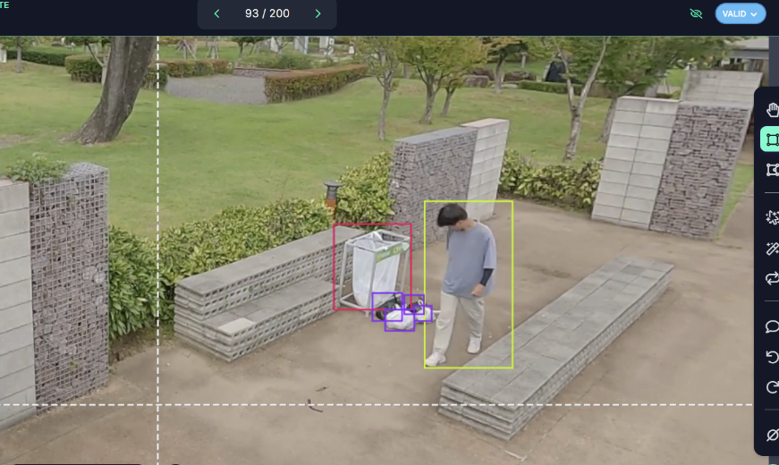

# 🔥무단투기, 멈춰! : CCTV Object Detection_Illigal Dumping
### | Project
Due to the problem of illegal dumping of garbage, illegal dumping has been detected nationwide through the installation of CCTV. However, cctv's (such as smart warning boards) for preventing illegal dumping are surveillance cameras that can shoot video and guide audio and try to prevent them through audiovisual stimulation, and some are settings to catch illegal dumping through direct manpower input. If motion recognition cctv is used, the following expected effects can be obtained.

1. Reduce unnecessary surveillance personnel
2. Speed up response to unauthorized speculators through real-time detection


### | Stacks

 
 
   
   
  
   


### | Dataset
[AI hub_공원 주요시설 및 불법행위 감시 CCTV 영상 데이터](https://www.aihub.or.kr/aihubdata/data/view.do?currMenu=115&topMenu=100&dataSetSn=477)<br>
We use video that has various situations such as (one person / two people), (a tied garbage bag / an untethered garbage bag), (no trash can/ when there is a trash can but throwing it away somewhere else).

### | Model
**Yolov5**<br>
Among Yolo's many versions, it was selected as a model with a fast calculation speed (up to 140 frames per second), so it was considered suitable for real-time motion tracking.


### | Training
We use [Roboflow](https://roboflow.com/) for data labeling. Labeling was conducted by classifying it into three classes :<br> `Garbage` , `Bin`, `Person`<br>




### | Result
**F1-Confidence Curve : 0.92**
<br> 

**Precision-recall curve : 0.940**
<br>

### | Function
<br>
Run the yolov5 model to extract coordinates txt for each frame.<br>
-> After merging this into a csv file, only the garbage is identified and extracted based on the class ID. <br>
-> Through this process, the last change frame is extracted.

EX. last dump frame:<br>
1st garbage dump : 00 frame<br>
2nd garbage dump: 00 frame
...

### | Web
**Home Page** <br>This is the page you see when you try to enter the website. Here, the start button will take you to the video menu page on the left. 
<br><br>
There is a sidebar on the left, so you can click on the page you want. Click on the prometheus logo to go to the [club's main site](https://prometheus-ai.net/). Also, if you click Members, you can find out the members' GitHub addresses, and if you click Github, you can go to the project address.

**Video Page**
<br>

### | Members
|      김예지       |          김재영         |     장민주         |      장나래       |                                                                                                               
| :------------------------------------------------------------------------------: | :---------------------------------------------------------------------------------------------------------------------------------------------------: | :---------------------------------------------------------------------------------------------------------------------------------------------------------------------------------------------------: | :------------------------------------------------------------------------------: |  
|       |                          |                      |       |
|   [@jyhannakim](https://github.com/jyhannakim)   |    [@sevenrich03](https://github.com/sevenrich03)  | [@alswn-03](https://github.com/alswn-03)  | [@brandnewwwnarae](https://github.com/brandnewwwnarae)  |


### | Directory Structure
```
prometheus5_project_AIDrivingGuide/
│
├── README.md         
├── play.py   
├── inference.py           
├── __init__.py      
│
├── engine/           
│   ├── models.py    
│   ├── utils.py       
│   └── __init__.py   
│
├── models/           
│   ├── TrafficLights_Detection/
│   ├── Pedestrian_Detection/
│   └── Lane_Detection/
│
├── scripts/           
│   ├── train.sh   
│   └── inference.sh   
│
├── configs/           
│   └── model.yaml     
│
├── assets/           
│   ├── feedback.json
│   └── ... 
│
└── app/              
    ├── app.py      
    ├── home.py      
    ├── feedback.py      
    ├── helper.py      
    ├── settings.py   
    ├── images/   
    └── videos/
  ```